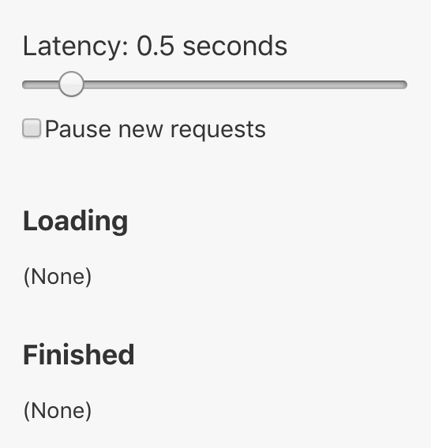

# React Suspense Demo
This project has the goal to test some Suspense and Concurrent Mode functionalities.

## Debugger

This project has a debugger module (shown in the image bellow). To show/hide this debugger press the `-` key.
[Debugger from jaredpalmer/react-conf-2018](https://github.com/jaredpalmer/react-conf-2018/blob/master/before-suspense/src/Root.js)

This debugger will also delay request to images that end with `-hd.jpg`.
[Patch from jaredpalmer/react-conf-2018](https://github.com/jaredpalmer/react-conf-2018/blob/master/before-suspense/patches/webpackDevServer.config.js)

## Cheating Folder

In this project there is a `cheating` folder that has every experiment that was done.

## Initial Run

To run this project in your machine please run the following commands:
`npm ci` and `npm start`

## Learn More

### Youtube Videos

[Concurrent Rendering in React - Andrew Clark and Brian Vaughn - React Conf 2018](https://youtu.be/ByBPyMBTzM0)

[Suspense! - Dan Abramov - ReactFest](https://youtu.be/6g3g0Q_XVb4)

[Moving To React Suspense - Jared Palmer - React Conf 2018](https://youtu.be/SCQgE4mTnjU)

[Overview of React Concurrent Mode - Harry Wolff](https://youtu.be/8_ZjNnUqarg)

[How does React Suspense Work? - Harry Wolff](https://youtu.be/onrMjAGY4qA)

### React Documentation

[Strict Mode](https://reactjs.org/docs/strict-mode.html)

[Error Boundaries](https://reactjs.org/docs/error-boundaries.html)

[Code-Splitting](https://reactjs.org/docs/code-splitting.html)

[Suspense for Data Fetching](https://reactjs.org/docs/concurrent-mode-suspense.html)

[Introducing Concurrent Mode](https://reactjs.org/docs/concurrent-mode-intro.html)

[Concurrent Mode API Reference](https://reactjs.org/docs/concurrent-mode-reference.html)
